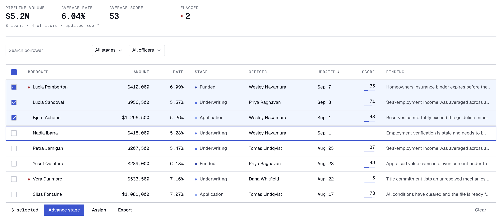

# Loan pipeline table



A dense table for the officers and processors who watch a mortgage pipeline all day. It carries stage, officer, money and an AI review per file, and is driven from the keyboard.

App at `/`, Storybook at `/storybook` (`pnpm build:vercel`).

## Decisions

**One ratio, 1.2, from a 13px body.** Sizes close together (11, 13, 16, 19, 23) let a label, a value and a title differ without shouting.

**An 11px floor.** Below it Geist Mono stops being readable.

**A 4px baseline.** Rows are 32px compact, 44px comfortable, header included.

**Contrast, measured.** `pnpm contrast` resolves the token graph, exiting non-zero under threshold.

| Pair | Ratio | Min |
| --- | --- | --- |
| `--ink-primary` on ground/hover/selected | 18.58/16.57/16.59 | 7 |
| `--ink-secondary` on ground/hover/selected | 8.76/7.81/7.82 | 7 |
| `--ink-muted` on `--ground` | 4.63 | 4.5 |
| stage fg on its bg (5 badges) | 6.59–9.09 | 4.5 |
| `--danger-fg` on ground/danger-bg | 7.44/6.34 | 4.5 |
| `--ink-inverse` on `--accent` | 7.04 | 4.5 |
| `--focus` on ground/selected | 7.04/6.28 | 3 |
| `--ink-muted` on `--ground-inert`, disabled | 4.13 | 3 |

**The focus ring is inset.** An outline draws outside the box, overlapping the row above and clipping against scroll containers. An inset shadow costs no layout, so it survives hover and selection at once.

**The panel docks.** It takes its 360px from the table rather than floating over it, so nothing is ever hidden behind it.

**Numbers right, words left.** Magnitudes stack and names scan. Tabular figures on every number. No vertical rules.

**One hue, OKLCH 270.** Neutrals at near-zero chroma, accent at full chroma, stage ramp between. Pipeline stages are a sequence, not five identities, so they take a validated ordinal ramp shown as a dot beside the written word: colour encodes progress, the label carries identity, neither alone. The dot is decorative and the written word carries the meaning, so the light end of the ramp is not held to text contrast.

**Flagged is derived.** Done review, score under 40. A dot in a gutter reserved on every row, so names stay aligned.

**One primary action per state.** The bulk bar, empty and error states each carry one filled button.

**44px on fingers, 32px on cursors.** A finger rule, so controls grow to it behind `pointer: coarse`, not everywhere.

**Keyboard.** Arrows move focus, Space toggles selection, Shift with an arrow extends, Enter opens the panel, Escape closes it or clears the selection. Focus stays separate from selection; one row is tabbable.

**Motion.** Entrances decelerate, exits accelerate. Transforms sit behind `prefers-reduced-motion: no-preference`; under `reduce` things fade and loops stop.

## Running

```sh
pnpm dev
pnpm test       # jsdom unit tests
pnpm storybook  # permutations
pnpm contrast   # table above
pnpm build      # typecheck and bundle
pnpm exec vitest run --project storybook   # stories + axe
```
